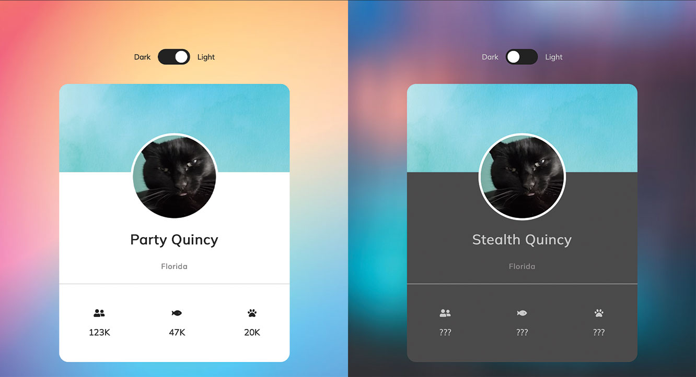

<h1><strong>Stealth Quincy Profile</strong></h1>

<h2>Objective</h2>

Profile website user interface code using mouseover &amp; DOM events to toggle.

<h3>Description</h3>

DOM events include mouseover event upon hover that changes span class text, and if and else statements to change the style applied to the page when the Dark/Light toggle is clicked on.

<h4>JavaScript Toolbox:</h4>

* DOM manipulation
* querySelector
* mouseover event
* event listeners
* event handlers 
* click event
* innerText

